# SNS 크리에이터 스튜디오 API ERD

REF-104 전수 조사 결과를 기반으로, 각 API를 테이블로 모델링한 ERD.

## Relations

- [[REF-104 SNS 플랫폼별 크리에이터 스튜디오 전체 탭 API 전수 조사]] - (이 ERD의 데이터 소스)
- [[SNS 게시물별 조회수 추적]] - (이 ERD의 상위 프로젝트)

## Observations

- [impl] 플랫폼별 PK가 다름 — YouTube=videoId, TikTok=item_id, Meta=row_id/ad_id #data-model
- [impl] YouTube get_creator_channels의 features 115개 key는 boolean 플래그 맵 — 정규화 시 EAV 고려 #schema
- [impl] TikTok aweme/v2/data/insight는 채널 레벨 시계열 — item_list는 게시물 레벨 스냅샷, 서로 다른 granularity #granularity
- [impl] Meta am_tabular는 이미 EAV 구조 (dimension+atomic+action) — 별도 정규화 불필요 #schema
- [note] Meta BS는 단일 GraphQL 엔드포인트에 doc_id로 분기 — ERD에서 tofu_unified_table만 포함 #caveat

## ERD

```mermaid
erDiagram

    %% ===== YouTube Studio =====

    YT_CHANNEL ||--o{ YT_VIDEO : contains
    YT_CHANNEL ||--|| YT_CHANNEL_SETTINGS : "1:1 설정"
    YT_CHANNEL ||--|| YT_DASHBOARD : "1:1 요약"
    YT_CHANNEL ||--o{ YT_ANALYTICS : "일별 측정"
    YT_VIDEO ||--o{ YT_COMMENT : has
    YT_VIDEO }o--o{ YT_DASHBOARD : "TOP_VIDEOS"

    YT_CHANNEL {
        string channelId PK
        string externalChannelId UK
        boolean isOfficialArtistChannel
        object monetizationStatusData
        object features "115 feature keys"
        object permissions
        string responseStatus
    }

    YT_VIDEO {
        string videoId PK
        string channelId FK
        string title
        string description
        string status "PROCESSING PROCESSED"
        string privacy "PUBLIC PRIVATE UNLISTED"
        string contentType
        string timePublishedSeconds
        string lengthSeconds
        int videoDurationMs
        string viewCount
        string externalViewCount
        string likeCount
        string commentCount
        string dislikeCount
        string clipCount
        string downloadUrl
        string shareUrl
        string watchUrl
        object thumbnailDetails
        object shorts
        object remix
        object collaboration
    }

    YT_CHANNEL_SETTINGS {
        string externalChannelId PK
        string brandTitle
        string description
        string vanityUrl
        string handle
        string businessEmail
        object banner
        object userSetProfilePicture
        boolean titleWriteable
        array shelfInfo "12 shelves"
        object homeTab
        array channelLinksInfo
    }

    YT_DASHBOARD {
        string channelId FK
        object topVideos "resultTable metricColumns"
        object currentMetrics "VIEWS WATCH_TIME SUBS"
        object typicalPerformance
        object lifetimeSubscribers
        object recentActivity
        object entitySnapshot
    }

    YT_ANALYTICS {
        string channelId FK
        string tabType "overview content audience"
        array cards "8-15 cards"
        object chartData "시계열 차트"
        object metricData "KPI 메트릭"
        object sideEntities "필터 메타"
    }

    YT_COMMENT {
        string commentId PK
        string videoId FK
        string textDisplay
        string authorDisplayName
        string authorChannelUrl
        int likeCount
        boolean canReply
        string publishedAt
    }

    %% ===== TikTok Creator Center =====

    TT_USER ||--o{ TT_ITEM : creates
    TT_USER ||--|| TT_HASH_COUNT : "1:1 카운트"
    TT_USER ||--|| TT_FOLLOW_COUNT : "1:1 팔로우"
    TT_USER ||--|| TT_INSIGHT : "1:1 시계열"
    TT_ITEM ||--o{ TT_COMMENT : has

    TT_USER {
        string userId PK
        string secUid UK
        string nickName
        string uniqId
        string profileBio
        string website
        string region
        string locale
        boolean isVerified
        boolean isPrivate
        int userStatus "1=정상 2=정지"
        object specialAccount "Seller Music Live"
        string createTime
    }

    TT_ITEM {
        string item_id PK
        string userId FK
        string desc
        string vid
        int duration "ms"
        string play_count
        string like_count
        string comment_count
        string share_count
        string favorite_count
        int visibility "1=전체 0=팔로워"
        int status "102=정상"
        boolean in_review
        boolean is_pinned
        string create_time
        string post_time
        string schedule_time
        array cover_url
        array play_addr
        object download_info
        object permissions
    }

    TT_INSIGHT {
        string userId FK
        array vv_history "16일 조회수"
        array pv_history "16일 페이지뷰"
        array like_history "16일 좋아요"
        array comment_history "16일 댓글"
        array share_history "16일 공유"
        array follower_num_history "16일 팔로워"
        array reached_audience_history "16일 도달"
        array net_follower_history "nullable"
        array video_vv_history_7d "nullable"
        array video_vv_history_48h "nullable"
    }

    TT_HASH_COUNT {
        string userId FK
        string item_count
        string total_item_count
        string new_friends_see_item_count
        string new_non_friends_see_item_count
        string repined_count
        string unread_visitor_count_v2
        string item_repin_count
    }

    TT_FOLLOW_COUNT {
        string userId FK
        string followerCount
        string followingCount
        string friendCount
    }

    TT_COMMENT {
        string commentId PK
        string item_id FK
        string text
        string authorUid
        int cursor
        boolean hasMore
    }

    %% ===== Meta Business Suite =====

    META_PAGE ||--o{ META_ORGANIC_POST : publishes
    META_PAGE ||--o{ META_AD_PERF : "runs ads"
    META_AD_PERF ||--o{ META_AD_IMAGE : uses

    META_PAGE {
        string id PK
        string name
        string category
        string link
        string website
        string currency
        int engagement_count
        boolean is_published
        boolean is_verified
        object connected_instagram_account
        boolean has_whatsapp_number
        boolean is_messaging_enabled
        string page_token
        string access_token
        object business
        int messenger_sends_l28
        int connected_ig_sends_l28
        string ctx_ml_scores "wtm wtd wtwa"
    }

    META_ORGANIC_POST {
        string row_id PK
        string pageId FK
        string entity_type "FB or IG"
        string title
        int views
        int reach
        int engagement
        int reactions
        int comments
        int shares
        string published_at
        object header
        object fields
    }

    META_AD_PERF {
        string ad_id PK
        string campaign_id FK
        string adset_id FK
        string ad_name
        string date_start
        string date_stop
        string impressions
        string reach
        string clicks
        string spend
        string cpm
        string cpc
        string ctr
        string frequency
        array actions
        array conversions
        string results
        string cost_per_result
        string quality_ranking
        string engagement_rate_ranking
        string conversion_rate_ranking
    }

    META_AD_IMAGE {
        string id PK
        string ad_id FK
        string name
        string hash
        string status
        int width
        int height
        string url
        string url_128
        string url_256
        string permalink_url
        float aes_rating "ML 품질 0-10"
        float aes_balance_elements
        float aes_rot
        object ads_integrity_review_info
        string created_time
    }
```

## 테이블 요약

| 플랫폼 | 테이블 | PK | 주요 관계 | 원본 API |
|---|---|---|---|---|
| YouTube | YT_CHANNEL | channelId | → VIDEO, SETTINGS, DASHBOARD, ANALYTICS | get_creator_channels |
| YouTube | YT_VIDEO | videoId | ← CHANNEL, → COMMENT | list_creator_videos |
| YouTube | YT_CHANNEL_SETTINGS | externalChannelId | ← CHANNEL | get_channel_page_settings |
| YouTube | YT_DASHBOARD | channelId | ← CHANNEL, ↔ VIDEO | get_channel_dashboard |
| YouTube | YT_ANALYTICS | channelId+tabType | ← CHANNEL | yta_web/get_screen |
| YouTube | YT_COMMENT | commentId | ← VIDEO | comment/get_comments |
| TikTok | TT_USER | userId | → ITEM, HASH_COUNT, FOLLOW, INSIGHT | web/user |
| TikTok | TT_ITEM | item_id | ← USER, → COMMENT | item_list/v1 |
| TikTok | TT_INSIGHT | userId | ← USER | aweme/v2/data/insight |
| TikTok | TT_HASH_COUNT | userId | ← USER | getHashCount |
| TikTok | TT_FOLLOW_COUNT | userId | ← USER | multiGetFollowRelationCount |
| TikTok | TT_COMMENT | commentId | ← ITEM | commentsV2 |
| Meta | META_PAGE | id | → POST, AD_PERF | facebook_pages |
| Meta | META_ORGANIC_POST | row_id | ← PAGE | tofu_unified_table |
| Meta | META_AD_PERF | ad_id+date | ← PAGE | am_tabular |
| Meta | META_AD_IMAGE | id | ← AD_PERF | adimages |